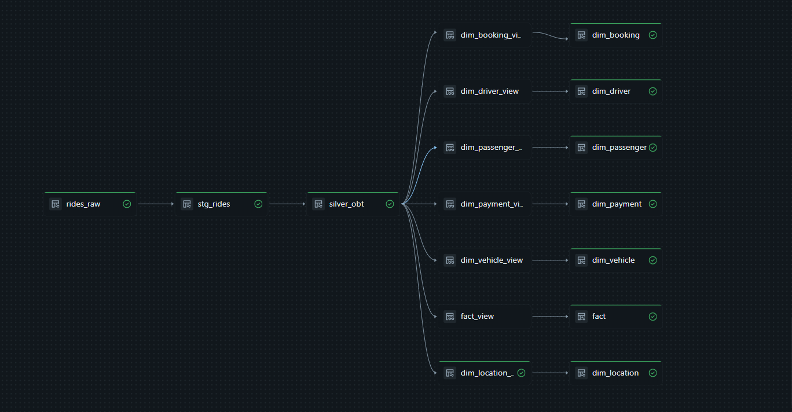
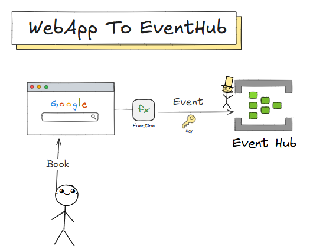
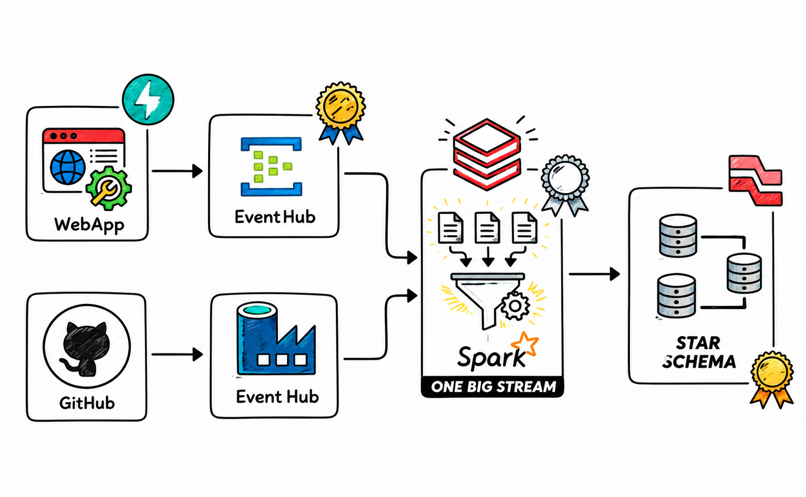

# 🚖 End-to-End Real-Time Uber Data Engineering Pipeline on Azure

> **Production-inspired Real-Time Data Engineering Pipeline built using Azure Event Hubs, Azure Data Factory, Azure Databricks, Spark Structured Streaming, Delta Lake and Spark Declarative Pipelines (Lakeflow).**

---

# 📌 Project Overview

Modern organizations process data from multiple sources simultaneously. Some data arrives continuously as events, while other datasets are periodically updated from operational systems.

This project demonstrates how to build a **production-style Lakehouse Data Engineering pipeline** capable of processing **both streaming and batch data** using Microsoft Azure.

The pipeline simulates an Uber ride-booking platform where:

* 🚖 Ride booking events are generated in real time through a custom web application.
* ⚡ Events are streamed using Azure Event Hubs.
* 📂 Historical and reference datasets are ingested from GitHub using Azure Data Factory.
* 🥉 Raw data is stored in Azure Data Lake Storage Gen2 (Bronze Layer).
* 🥈 Historical and streaming data are merged using Spark Declarative Pipelines (Append Flow) to build a business-ready **One Big Table (OBT)**.
* 🥇 The Gold layer generates a dimensional model (Fact & Dimension tables) using **AUTO CDC Flow** for Slowly Changing Dimensions (Type 1 & Type 2).

The project follows the **Medallion Architecture** and demonstrates industry-standard concepts such as metadata-driven ingestion, structured streaming, Delta Lake, Star Schema modeling, and Change Data Capture.

---

# 🏗️ Solution Architecture

## Overall Solution Architecture


---

## Databricks Declarative Pipeline



---

# 🛠️ Tech Stack

<p align="center">
  
</p>

<p align="center">
  Azure Data Factory • Azure Event Hubs • Azure Data Lake Storage Gen2 • Delta Lake • Spark Structured Streaming • Lakeflow Declarative Pipelines • Databricks SQL • AUTO CDC Flow
</p>

---


# 📂 Project Structure

```text
uber-real-time-data-engineering-pipeline
│
├── Cods_Files
│   ├── bronze_adls.ipynb
│   ├── silver_obt.ipynb
│   ├── silver_obt.sql
│   ├── ingest.py
│   ├── silver.py
│   ├── model.py
│   ├── connection.py
│   ├── data.py
│   ├── api.py
│
├── Data
│   ├── bulk_rides.json
│   ├── files_array.json
│   ├── map_cities.json
│   ├── map_vehicle_types.json
│   ├── map_vehicle_makes.json
│   ├── map_payment_methods.json
│   ├── map_ride_statuses.json
│   └── map_cancellation_reasons.json
│
├── images
│   ├── architecture.png
│   ├── pipeline_graph.png
│   ├── bronze_layer.png
│   ├── silver_layer.png
│   ├── gold_layer.png
│   ├── adf_pipeline.png
│   ├── eventhub.png
│   ├── star_schema.png
│   └── obt.png
│
└── README.md
```

---

# 🔄 End-to-End Data Pipeline

## 1️⃣ Streaming Data Source

A custom-built Uber Web Application continuously generates ride booking events.

These events are published to **Azure Event Hubs**, providing a scalable and fault-tolerant streaming ingestion layer.





## 2️⃣ Batch Data Source

Historical datasets and reference mapping files are maintained in GitHub.

These include:

* Cities
* Vehicle Types
* Vehicle Makes
* Ride Status
* Payment Methods
* Cancellation Reasons

Azure Data Factory ingests these datasets into Azure Data Lake Storage.

---

## 3️⃣ Metadata-Driven Azure Data Factory Pipeline

Rather than hardcoding file names, the pipeline uses a **Lookup Activity** to read a JSON configuration file (`files_array.json`).

The returned file list is processed dynamically using a **ForEach Activity**, making the ingestion framework scalable and reusable.

📷


---

# 🥉 Bronze Layer

The Bronze layer stores raw data exactly as received.

### Streaming Data

* Ride Booking Events

### Batch Data

* Historical Ride Data
* Mapping Files

No transformations are performed at this stage.

📷


---

# 🥈 Silver Layer

The Silver layer performs business transformations.

Streaming data only contains newly arriving events.

Historical data already exists in storage.

To unify both datasets, **Spark Declarative Pipelines Append Flow** merges streaming and historical records into a single staging table.

```
Historical Data

+

Streaming Data

↓

Unified Staging Table
```

The staging table is then enriched by joining multiple mapping datasets to create a business-ready **One Big Table (OBT)**.

📷


---

# 🥇 Gold Layer

The Gold layer transforms the OBT into a dimensional model optimized for analytics.

### Fact Table

* fact_rides

### Dimension Tables

* dim_driver
* dim_booking
* dim_vehicle
* dim_location
* dim_payment
* dim_passenger

AUTO CDC Flow is used to implement Slowly Changing Dimensions.

### SCD Type 1

* Driver
* Passenger
* Booking
* Payment
* Vehicle

### SCD Type 2

* Location

📷


---

# ⭐ Star Schema

The final analytical model follows a Star Schema.

* Central Fact Table
* Business Dimensions
* Optimized for BI Reporting
* Analytical Queries
* Dashboarding

📷


---

# 📊 Databricks Pipeline Graph

Spark Declarative Pipelines automatically orchestrate streaming transformations, views, dimension tables, and fact tables.

📷


---

# 📈 Data Flow

```text
                     Custom Uber Web Application
                                │
                                ▼
                       Azure Event Hubs
                                │
                 Spark Structured Streaming
                                │
                                ▼
                    Bronze Streaming Table
                                │
                                │
      GitHub Repository (Mapping & Historical Files)
                                │
                                ▼
                    Azure Data Factory
          Lookup → ForEach → Copy Activity
                                │
                                ▼
                Bronze Layer (ADLS Gen2)
                                │
                                ▼
              Spark Declarative Pipelines
                     Append Flow
                                │
                                ▼
                  Unified Staging Table
                                │
                Join Mapping Tables
                                │
                                ▼
                Silver One Big Table (OBT)
                                │
                     AUTO CDC Flow
                                │
                                ▼
                      Gold Layer
                                │
                Fact + Dimension Tables
```

---

# ⚙️ Key Features

* Real-Time Streaming Pipeline
* Azure Event Hubs Integration
* Azure Data Factory Metadata-Driven Pipeline
* Dynamic Lookup Activity
* ForEach Activity
* Batch + Streaming Integration
* Spark Structured Streaming
* Delta Lake
* Spark Declarative Pipelines (Lakeflow)
* Append Flow
* AUTO CDC Flow
* One Big Table (OBT)
* Slowly Changing Dimension Type 1
* Slowly Changing Dimension Type 2
* Star Schema Modeling
* Medallion Architecture
* End-to-End Lakehouse Pipeline

---

# 📸 Project Screenshots

| Component             | Screenshot                     |
| --------------------- | ------------------------------ |
| Solution Architecture |    |
| Azure Data Factory    |    |
| Event Hub             |        |
| Bronze Layer          |    |
| Silver Layer          |    |
| Gold Layer            |      |
| Pipeline Graph        |  |
| Star Schema           |     |

---

# 🚀 Future Enhancements

* Unity Catalog Integration
* Databricks Asset Bundles
* CI/CD with Azure DevOps
* Data Quality Checks
* Great Expectations Integration
* Power BI Dashboard
* Monitoring & Alerting
* Performance Optimization
* Incremental Data Validation

---

# 👨‍💻 Author

**Avinash Kamble**

Aspiring Azure Data Engineer

---

## ⭐ One important suggestion

Your current architecture diagram is good, but if you redesign it with **official Azure service icons** (Azure Architecture Icons) and a cleaner layout, the repository will look significantly more professional. Combined with this README, it will resemble the kind of polished project portfolio that hiring managers often expect from junior-to-mid-level data engineering candidates.
